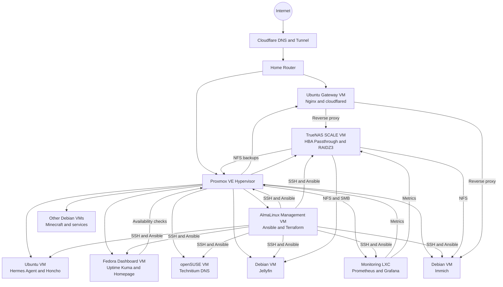

# Zaman Labs Homelab Documentation

This repository is the organized technical record for the Zaman Labs homelab. It covers the Proxmox platform, management VM, storage, DNS, monitoring, applications, automation, and the Hermes Agent environment.

The individual documents preserve the original implementation notes and troubleshooting history. They are grouped by system instead of by chronological STEP number so the repository can grow as a living technical notebook.

> [!IMPORTANT]
> This repository contains documentation, not a one-command deployment. Review every command before running it. Version numbers, IP addresses, paths, and application behavior may change after a document was written.

## High-Level Architecture

## Documentation Index

| Area | Contents |
|---|---|
| [Proxmox](proxmox/) | Hypervisor hardening and backups to TrueNAS |
| [Security](security/) | SSH public-key-only authentication |
| [Management](management/) | AlmaLinux control VM and Terraform/Ansible VM workflow |
| [Gateway](gateway/) | Central Ubuntu gateway, Nginx, and Cloudflare Tunnel |
| [Storage](storage/) | TrueNAS, HBA passthrough, RAIDZ3, and SMB |
| [DNS](dns/) | Technitium DNS on openSUSE Leap |
| [Media](media/) | Jellyfin deployment and TrueNAS media access |
| [Monitoring](monitoring/) | Uptime Kuma, Homepage, Prometheus, Grafana, and exporters |
| [Applications](applications/) | Immich and File Browser remote-access deployments |
| [Automation](automation/) | Current Ansible architecture and Terraform references |
| [AI](ai/) | Hermes Agent, self-hosted Honcho, and Hogwarts operating model |
| [Repository notes](docs/) | Source mapping and publication checklist |

## Current Ansible Source of Truth

The old STEP 11 notes are not included. The current automation documentation is based on the live [`IlhamZaman/ansible-homelab-automation`](https://github.com/IlhamZaman/ansible-homelab-automation) repository as reviewed on **August 3, 2026**.

See [automation/ansible](automation/ansible/) for the current inventory groups, playbooks, scripts, safety controls, and configuration model.

## Documentation Rules

- Keep secrets, private keys, API tokens, passwords, `.env` files, Terraform state, and raw backup archives out of Git.
- Use placeholders in public examples.
- Record the goal, architecture, implementation, validation, problems, root cause, and recovery steps for each major change.
- Update the relevant system folder instead of creating a new chronological STEP file.
- Treat commands copied from historical notes as examples until verified against the live system.
